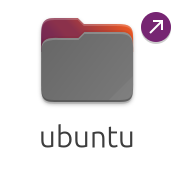

# Ubuntu终端命令

## 一、基础文件指令

### (一)文件列表

`ls`，即***list***，表示列出目录下的所有项。

*示例：*

- 查看当前目录

      ls
 
 - 查看/home目录

      ls /home

***（\*）要点和细节：***
- 1\.在输入命令和路径时，按TAB键可以自动补全

> **ls** **/ho** ——> **ls** **/home**

- 2\.输入历史可以翻阅:按上下箭头可以上下翻阅

- 3\.宿主机 与 虚拟机之间可以拷贝粘贴,一般情况下，文本和文件都可以拷贝

- 4\.文件路径，会显示文件详细信息

      ls -l

### (二)显示当前位置

`pwd`，即***print*** ***working*** ***directory***，显示当前工作目录

### (三)切换目录

`cd`，即***change*** ***directory***，切换目录

*示例：*

- 切换到用户主目录

      cd

- 切换到home目录

      cd /home

***（\*）几个特殊的目录***

- 1\.`~`代表当前用户的主目录

- 2\.`.`代表当前目录

- 3\.`..`代表上一级目录

- 4\.`cd ~` 切换到主目录

- 5\.`cd ~/test` 切换到主目录下的test目录

- 6\.`cd ../www` 切换到上级目录，再到www子目录

***（\*）在`ls`命令中，也可以使用`~` `.` `..`表示的路径***

    ls ~

---    

    ls ./www

***（\*）还可以文件中复用***

    ./hello/abc/../123/./other/test.xml

### (四)目录操作

`mkdir`，即***make*** ***directory***，创建目录

*示例：*

    mkdir abc

    mkdir -p abc/123/test

**使用-p参数，可以将路径的层次目录全部创建**

`rmdir`，即***remove*** ***directory***，删除空目录

*示例：*

    rmdir abc

**如果目录非空，则删除失败**

`rm`，即***remove***，删除文件或者目录

*示例：*

    rm -rf abc

删除abc目录，和子项一并删除

其中，`r`表示**recursive**，`f`表示**force**

玩笑：**rm** **-rf** /\*删库跑路

（iv）`cp`，即***copy***复制文件或者目录

*示例：*

    cp -rf test test2

把**test**复制在当前路径，命名为**test2**

如果**test2**目录已经存在，则会复制到**test2**下边

（v）`mv`，即***move***，移动文件或目录（重命名）

示例：

    move hello helloworld

---

## 二、归档和解包

`tar`，即***tape archive***档案打包

### (i)创建档案包

*示例：*

> **tar** **-cvf** **example.tar** **example**

指把“example”打包成“example.tar”这个文件

其中的 ***"cvf"***

`c`，表示***create***,创建档案

`v`，表示***verbose***,显示详情

`f`,表示***file***,文件

也可以多个目录打包

> **tar** **-cvf** **xxx.tar** **(file1)** **(file2)** **(file3)**

### (ii)还原档案包

*示例：*

> **tar** **-xvf** **example.tar**

> **tar** **-xvf** **example.tar** **-C** **outdir**

其中，默认解到当前目录下，加上`-C`参数指定目标目录.

先前的**tar**格式并没有压缩，体积比较大

### (iii)并档并压缩

*示例：*

> **tar** **-zcvf** **example.tar.gz** **example**

### (iv)解压缩

*示例：*

> **tar** **-zxvf** **example.tar.gz**

> **tar** **-zxvf** **example.tar.gz** **-C** **outdir**

通常我们所见的，都是`\*.tar.gz`这种格式

---

## 三、软链接

软链接，即Windows下的“快捷方式”

使用`ln`命令（link）来创建软链接

*示例：*

> **ln** **-s** **(源文件)** **(软链接名)**

其中，`-s`表示soft软链接（默认为硬）

比如

> **ln** **-s** **example** **example2**

软链接特点：

- 删除软链接，对原文件没有影响
- 删除原文件，则软链接失效

以`ls -l` 查看文件详情时，可以看到目标路径

比如

> **ls** **-l** **/**

可以发现，`/bin` 实际指向是`/usr/bin`目录

文件带有箭头的就算软链接

---

## 四、用户管理

添加一个用户

> **sudo** **useradd** **-m** **test1**

其中，

**(\*)sudo，表示以管理员身份执行**

*示例：*

### 1. 添加用户:useradd

> **sudo** **useradd** **-m** **test1**

其中，`-m`参数表示在`/home`下添加用户目录

### 2. 修改用户密码

> **sudo** **passwd** **test1**

然后会弹出`新的 密码：`

这时候输入密码是不显示的，但确实会有响应

### 3. 删除用户:userdel

> **sudo** **userdel** **test1**

一般配套`sudo rm -rf `(文件路径)在删除用户的同时，删除目录

**(\*)要点和细节**

1. 在登录系统时，默认不允许以***root***用户登录
2. 只有特殊的用户，才能执行`sudo`

在Linux下，把能执行`sudo`命令的用户叫***sudoer***

---

## 五、超级用户

超级用户***root***

类似于**Windows**下的***Administrator***用户

切换到***root***用户，有全部权限，可以直接`useradd`等命令

### 1. 首次使用时，需要给root设置密码

> **sudo** **passwd** **root**

因保密原因，输入密码不显示

### 2. 切换到root用户

> **su** **root**

其中，`su`表示***switch*** ***user***

### 3. 退出

> **exit**

**(\*)要点和细节**

1. `su root` 仅仅对当前会话（终端）有效

不影响当前桌面环境

2. ***root***权力太大，需要小心使用

---

### 六、用户和组

Linux下可以创建多个用户，可以用组进行管理用户。

比如：

男生组boys

 (输入名字，下同) (ming) (bo) (gang) (qiang)

女生组girls

(fang) (hong) (yue) (yuan)

**1. 创建组**

> **groupadd** **(输入组名）**

**2. 创建用户**

> **useradd** **-m** **-g** **（组名）** **（用户）**

其中，`-g`表示在添加用户，同时将用户加到**boys组**

**3. 修改现有用户到新的组**

> **usermod** **-g** **（输入组名）** **（输入用户）**

其中,`usermod`表示修改用户信息

**4. 查看用户和组**

> **cat** **/etc/group**

显示的信息：每一行表示一个group的信息，名称+ID

**5. 查看用户列表**

> **cat** **/etc/（密码）**

每一行表示一个用户的信息

**(\*)用户不多时，管理的时候并不使用组的概念**

> **useradd** **a1**

> **useradd** **b1**

一个root,两个普通用户a1,b1,够用了！

默认地，会给a1用户建立一个同名的组a1

也就是说这个组里只有他一个人

---

## 七、用root登录桌面

默认地，Ubuntu不允许以root登录桌面环境。

**(i)设置root密码**

首次执行时需要修改root密码

> **sudo** **passwd** **root**

**(ii)修改配置**

在终端里，切换到root用户

> **su** **root**

> **gedit** **/etc/pam.d/gdm-autologin**

在下面显示这一行前面加一个#

> 即 #auth  required  pam\_succeed\_if.so user != root quiet\_success

关闭并保存

> **gedit** **/etc/pam.d/gdm-password**

在下面显示这一行前面加一个#

> 即 #auth requiredpam\_succeed\_if.so user != root quiet\_success

关闭并保存

关闭虚拟机，重启后生效

**(\*)#表示所在行数无效，表示为注.释行**

---

## 八、文件权限

### (一)文件的权限

**1.考虑的方面：**

- `owner`:文件的属主***owner***
- `r`:文件是否可读***read***
- `w`:文件是否可写***write***
- `x`:文件是否可以执行***excute***

**2、查看文件权限：**

> **ls** **-l** **(文件名+后缀)**

操作显示：

> (链接/子项数).(1) (属主) (所在组) (文件大小) (修改时间) (文件名+后缀)

其中，`-|rw-|r--|r---`表示该文件的访问权限,

**(1)第一个`|`前的字符：`-`表示文件,`d`表示目录,`l`表示链接,`c`是字符设备,`b`是硬盘类**

**(2)其余的`---|---|---`分别表示`自己|同组|他人`**

**(3)`1`表示有1项。**

### (二)修改文件权限

`chmod`,即***change*** ***file*** ***mode***修改文件的访问权限

文件的属主或超级用户可以修改文件

比如，一个test.txt文件，想让别人也能修改

> **chmod** **o+w** **test.txt**

其中，

`a`/`u`/`o`,表示:***all***所有人/***user***自己/***other***别人，省略则表示默认自己和本组

`+`/`-`表示:**增加**/**减去**

`r`/`w`/`x`,表示:***read***/***write***/***excute***权限

### (三)修改文件的属主

`chown`,即***change*** ***owner***修改文件的属主

一般来说，每个用户只操作自己的用户目录，所以并不常用

*示例：*

> **chown** **-R** **(另一个用户)** **(目录路径)**

`-R`表示在该目录下的所有文件和子文件

---

## 九、脚本

脚本Script，一种解释执行的程序

Linux常见的三种脚本程序

- **Shell脚本 `\*.sh`**
- **Perl脚本 `\*.pl`**
- **Python脚本 `\*py`**

脚本程序，本质是一个文本文件

**1、它是一个文本文件**

**2、它具有可执行权限**

**(\*)执行脚本文件**

脚本程序都是由解释器来执行的

- **Shell脚本解释器： `/bin/sh`**

- **Perl脚本解释器：  `/bin/perl`**

- **Python脚本解释器：`/bin/python3`**

执行一个脚本，以下两种方式等效

> **./hello.py**

> **/bin/python3 hello.py**

### (一)Shell脚本

Shell脚本，按Shell的语法学出来的脚本

是Linux自带的脚本语言

相当于Windows下的DOS批处理脚本

**(i)编辑一个文本文件，保存为hello.sh**

    #!/bin/sh

    echo "hello,world"

**(ii)添加可执行权限**

    chmod +x hello.sh

**(iii)执行程序**

    ./hello.sh

    /(路径)/(路径).../hello.sh

## (二)Python脚本

**(i)编辑一个文本文件，保存为hello.py**

    #！/bin/python3

    print ("hello.python")

**(ii)添加可执行权限**

    chmod +x hello.py

**(iii)执行程序**

    ./hello.py

    /(路径)/(路径).../hello.py

**(\*)其中`./`表示当前路径**

---

## 十、Shell中的变量

(一)SHELL,是一个脚本编程语言

1. 定义变量
1. 执行命令 echo ls cd cp
1. if判断逻辑，while循环逻辑...
1. 自定义函数...

1. 定义一个简单变量

(变量名)=(变量值)

“=”两边不能加空格

1. 使用一个变量

${(变量名)}

如果已经有了定界符，则可以简写为$(变量名)

例如：

echo $(变量名)/build/...

只有一行的 ls $(变量名)

示例：

#!/bin/sh

#定义变量

OUTDIR=/opt

#使用变量

echo "output to : ${OUTDIR}"

ls ${OUTDIR}

"ls ${OUTDIR}"相当于执行了"ls /opt"

(二)环境变量

就是存在当前环境中的变量,是在当前环境就有的

典型的环境变量：PATH,JAVA\_HOME

(\*)定义环境变量

1. 在终端定义环境变量

export OUTDIR=/opt

1. 显示环境变量

echo ${OUTDIR}

1. 查看所有环境变量

printenv

在命令行中定义的环境变量，只对当前SHELL终端有效

当关闭终端后，重启后就消失了

(三)用户环境变量

用户环境变量：定义在脚本文件 ~/.profile中

在主目录下

ls -la

其中，a表示all,显示所有文件

注：在Linux下，以“.”开头的文件为隐藏文件

(\*)打开在.profile文件中定义环境变量

1. 用文本编辑器打开~/.profile

gedit ~/.profile

1. 添加

export JAVA\_HOME=/opt/jdk1.8

保存并关闭

1. 注销，重新登录后生效

echo $JAVA\_HOME

原理：当用户打开终端时，会自动运行.profile，将变量注入当前环境中。

(\*)要点与细节

1. 以点号“.”开头的文件为因此文件

ls -a 查看所有文件

1. 此配置只对当前用户有效

因为每个用户都有自己的配置文件.profile

1. 有的Linux系统上，使用.bash\_profile

(四)系统环境变量

系统环境变量：定义在/etc/profile中

此中的环境变量对 所有用户 有效

以root身份执行

gedit /etc/profile

但是，一般不直接修改/etc/profile

而是在/etc/profile.d创建一个自定义的脚本

示例：

1. 用gedit创建一个脚本

gedit /etc/profile.d/myprofile.sh

1. 定义环境变量

export TOMCAT=/opt/tomcat

1. 注销并重新登录

重新登录后，环境变量生效

(五)PATH环境变量

先来看一个问题：创建一个可执行脚本hello.sh

直接执行：

显示：shaofa@vmware:~$ hello.sh

hello.sh:未找到命令

(\*)

PATH，最常见的一个环境变量

用于描述可执行程序的搜索路径

echo $PATH

多个路径之间以冒号分隔

usr/local/bin:/usr/local/sbin:/usr/bin:usr/sbin

(i)默认地，系统从以下目录中搜索可执行程序

/usr/bin 比如，/usr/bin/tar

/usr/sbin 比如，/usr/sbin/useradd

/usr/local/bin

/usr/local/sbin

usr是unix shared resources(共享资源)的缩写

其中，sbin为超级用户root才能执行的程序

/usr/下系统自带的程序,/usr/local/是用户安装的程序

(ii)修改PATH环境变量

1. 编辑/etc/profile.d/myprofile.sh

gedit (路径)

在脚本(文本文件)设定PATH环境变量

export PATH=$PATH:(想要添加的路径)

1. 注销，重新登录后生效

